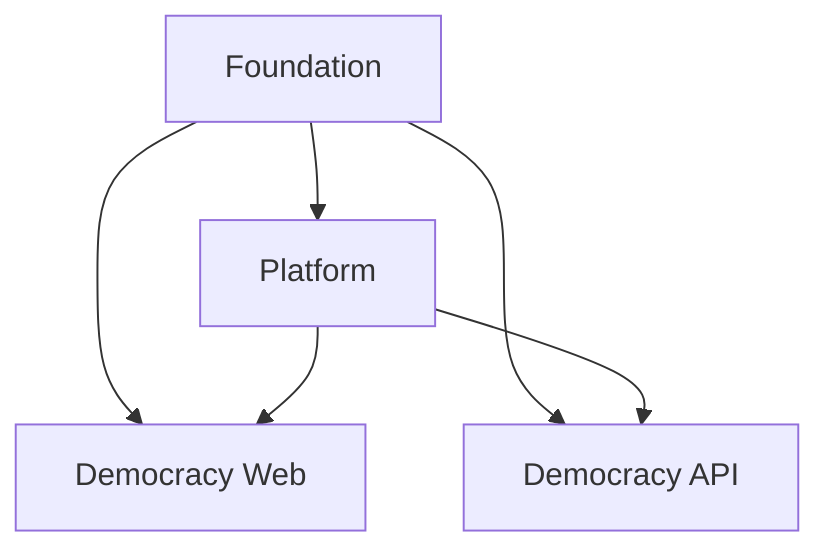

# Pulumi Project Restructuring - Best Practices Recommendations

## 🎯 Executive Summary

This document outlines a comprehensive strategy to restructure the current monolithic Pulumi project into multiple, well-organized projects and stacks following infrastructure-as-code best practices for DigitalOcean environments.

## 📊 Current State Analysis

### Current Structure
- **Single Project**: `democracy-deutschland` 
- **Single Codebase**: All resources managed in `/infrastructure/mixed/`
- **Resource Types**: VPCs, Kubernetes cluster, load balancers, droplets, domains, firewalls, projects
- **Environments**: dev, prod (based on Pulumi.dev.yaml, Pulumi.prod.yaml)

### Identified Issues
1. **Tight Coupling**: All resources in single project create unnecessary dependencies
2. **Blast Radius**: Changes to any component risk affecting entire infrastructure
3. **Team Collaboration**: Single project limits parallel development
4. **Resource Lifecycle**: Different resources have different update frequencies and lifecycles
5. **Security**: No granular access control per resource type
6. **Cost Management**: Difficult to track costs per service/team

## 🏗️ Recommended Architecture

### Multi-Project Strategy

#### 1. Foundation Project (`democracy-foundation`)
**Purpose**: Shared, long-lived infrastructure components
- VPCs and networking
- DNS zones and domain management
- Security groups and firewalls
- Spaces/Storage buckets

**Rationale**: These rarely change and are dependencies for other projects

#### 2. Platform Project (`democracy-platform`)
**Purpose**: Core platform services
- Kubernetes cluster
- Load balancers
- Monitoring infrastructure
- CI/CD infrastructure

**Rationale**: Platform components have different lifecycle than applications

#### 3. Application Projects
- `democracy-web` - Website droplets and related resources
- `democracy-api` - API services and databases
- `democracy-mobile` - Mobile app backend services

**Rationale**: Applications can evolve independently

#### 4. Environment-Specific Stacks
Each project will have multiple stacks:
- `dev` - Development environment
- `staging` - Staging environment  
- `prod` - Production environment

### Project Structure
```
infrastructure/
├── foundation/
│   ├── Pulumi.yaml
│   ├── src/
│   │   ├── networking/
│   │   ├── dns/
│   │   ├── security/
│   │   └── storage/
│   └── stacks/
│       ├── Pulumi.dev.yaml
│       ├── Pulumi.staging.yaml
│       └── Pulumi.prod.yaml
├── platform/
│   ├── Pulumi.yaml
│   ├── src/
│   │   ├── kubernetes/
│   │   ├── load-balancers/
│   │   └── monitoring/
│   └── stacks/
├── democracy-web/
│   ├── Pulumi.yaml
│   ├── src/
│   │   ├── droplets/
│   │   └── cdn/
│   └── stacks/
└── shared/
    ├── types/
    ├── utils/
    └── configs/
```

## 🔗 Stack Dependencies & Cross-Stack References

### Dependency Hierarchy


### Cross-Stack Reference Pattern
```typescript
// In platform project - referencing foundation VPC
import * as pulumi from "@pulumi/pulumi";

const foundationStack = new pulumi.StackReference("democracy-foundation/prod");
const vpcId = foundationStack.getOutput("kubernetesVpcId");

// Use in platform resources
export const cluster = new digitalocean.KubernetesCluster("cluster", {
    vpcUuid: vpcId,
    // ... other config
});
```

## 📋 Migration Plan

### Phase 1: Foundation Setup (Week 1-2)
**Objective**: Create foundation project and migrate networking

**Steps**:
1. Create new `democracy-foundation` project
2. Extract and migrate:
   - VPC configurations (`vpcs.ts`)
   - Domain management (`domains/`)
   - Firewall rules (`firewalls.ts`)
3. Set up cross-stack exports
4. Create dev/staging/prod stacks
5. Test deployment in dev environment

**Validation**:
- [ ] All VPCs deployed successfully
- [ ] Domains resolved correctly
- [ ] Firewall rules applied
- [ ] Cross-stack references working

**Rollback Plan**: Keep original project running until validation complete

### Phase 2: Platform Migration (Week 3-4)
**Objective**: Move Kubernetes and load balancing to platform project

**Steps**:
1. Create `democracy-platform` project
2. Migrate:
   - Kubernetes cluster (`kubernetes-cluster.ts`)
   - Load balancer (`load-balancer.ts`)
3. Update to use foundation stack references
4. Migrate existing cluster using `pulumi import`
5. Test application deployments

**Critical Considerations**:
- Use `pulumi import` to avoid recreating K8s cluster
- Ensure zero downtime during migration
- Update CI/CD pipelines to reference new stacks

**Validation**:
- [ ] Kubernetes cluster accessible
- [ ] Load balancer routing correctly
- [ ] Applications deployed and running
- [ ] No service interruption

### Phase 3: Application Separation (Week 5-6)
**Objective**: Separate applications into dedicated projects

**Steps**:
1. Create `democracy-web` project
2. Migrate droplet configurations
3. Create `democracy-api` project for future API resources
4. Update project associations
5. Clean up original monolithic project

**Validation**:
- [ ] All droplets running correctly
- [ ] Project associations updated
- [ ] Resource tagging consistent

### Phase 4: Optimization (Week 7-8)
**Objective**: Implement advanced patterns and monitoring

**Steps**:
1. Implement shared configuration management
2. Set up stack monitoring and alerting
3. Implement automated testing for infrastructure
4. Document operational procedures
5. Train team on new structure

## 🔧 Implementation Guidelines

### Configuration Management
```typescript
// shared/configs/base.ts
export interface BaseConfig {
  region: digitalocean.Region;
  environment: string;
  tags: string[];
}

export const getBaseConfig = (): BaseConfig => {
  const config = new pulumi.Config();
  return {
    region: config.get("region") as digitalocean.Region || digitalocean.Region.FRA1,
    environment: config.require("environment"),
    tags: config.getObject<string[]>("tags") || ["democracy"]
  };
};
```

### Stack Reference Pattern
```typescript
// Standard pattern for cross-stack references
export const createStackReference = (project: string, stack: string) => {
  return new pulumi.StackReference(`${project}/${stack}`);
};

// Usage
const foundation = createStackReference("democracy-foundation", pulumi.getStack());
const vpcId = foundation.getOutput("vpcId");
```

### Resource Naming Convention
- **Projects**: `democracy-{purpose}` (e.g., `democracy-foundation`)
- **Stacks**: Environment names (`dev`, `staging`, `prod`)
- **Resources**: `{purpose}-{resource-type}` (e.g., `k8s-cluster`, `web-vpc`)

## 🛡️ Security & Access Control

### Project-Level Access
- **Foundation**: Infrastructure team only
- **Platform**: Platform team + Senior developers
- **Applications**: Application teams + Platform team

### Stack-Level Protection
```typescript
// Critical resources should be protected
export const cluster = new digitalocean.KubernetesCluster("cluster", {
  // ... config
}, {
  protect: true,  // Prevent accidental deletion
});
```

## 💰 Cost Management Benefits

### Resource Tagging Strategy
```typescript
// Consistent tagging across all projects
const baseTags = {
  "team": "democracy",
  "environment": config.require("environment"),
  "project": "democracy-foundation",
  "managed-by": "pulumi"
};
```

### Cost Allocation
- Track costs per project using DigitalOcean project boundaries
- Monitor costs per environment using stack-level tagging
- Implement cost alerts per project

## 📊 Monitoring & Observability

### Stack Health Monitoring
```typescript
// Export key metrics from each stack
export const stackHealth = {
  resourceCount: pulumi.output(resources.length),
  lastUpdated: new Date().toISOString(),
  version: config.require("version")
};
```

### Deployment Tracking
- Implement deployment notifications
- Track dependency update success/failure
- Monitor cross-stack reference health

## 📚 Best Practices Summary

### DO's ✅
- Keep related resources together in same project
- Use StackReference for cross-project dependencies
- Implement consistent naming conventions
- Protect critical resources
- Tag all resources consistently
- Version your infrastructure code
- Implement proper CI/CD for each project

### DON'Ts ❌
- Don't create circular dependencies between stacks
- Don't put resources with different lifecycles in same project
- Don't bypass stack boundaries with hardcoded values
- Don't skip validation steps during migration
- Don't remove old resources until new ones are validated

## 🎯 Success Metrics

### Technical Metrics
- Deployment time reduction: Target 50% improvement
- Parallel development capability: Multiple teams can work simultaneously
- Blast radius reduction: Changes affect only relevant components
- Recovery time: Faster restoration of individual services

### Operational Metrics
- Team velocity increase
- Reduced merge conflicts
- Improved change approval process
- Better cost visibility

## 🔄 Maintenance Strategy

### Regular Reviews
- Monthly architecture review meetings
- Quarterly dependency analysis
- Annual cost optimization review

### Continuous Improvement
- Monitor for anti-patterns
- Evaluate new Pulumi features
- Update documentation regularly
- Share learnings across teams

## 📖 References & Resources

### Pulumi Documentation
- [Organizing Projects and Stacks](https://www.pulumi.com/docs/intro/concepts/organizing-stacks-projects/)
- [StackReference Documentation](https://www.pulumi.com/docs/intro/concepts/organizing-stacks-projects/#inter-stack-dependencies)
- [DigitalOcean Provider](https://www.pulumi.com/registry/packages/digitalocean/)

### DigitalOcean Best Practices
- [Project Organization](https://docs.digitalocean.com/products/projects/)
- [VPC Best Practices](https://docs.digitalocean.com/products/networking/vpc/)
- [Kubernetes Best Practices](https://docs.digitalocean.com/products/kubernetes/)

---

**Next Steps**: 
1. Review and approve this plan with the team
2. Set up development environment for testing
3. Begin Phase 1 implementation
4. Schedule regular check-ins during migration

**Document Version**: 1.0  
**Last Updated**: Mai 29, 2025  
**Author**: Infrastructure Team  
**Review Date**: Juni 29, 2025
